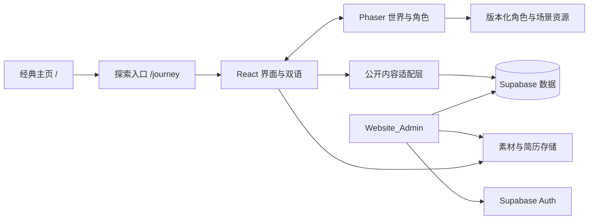

# 魔女旅行网站：实施计划与后台配套改造

更新日期：2026-09-15  
状态：规划完成稿；技术方案可随实际数据库和部署配置校正。  
需求基线：[详细需求](witch-journey-requirements.md)

## 1. 交付目标与当前边界

### 本轮交付

- 汇总用户已确认的全部要求。
- 检查 Website_Public、Website_Admin 的本地实现。
- 验证用户提供的管理域名公开入口。
- 制定七区探索、素材、双语、触控、后台、数据库和部署的完整计划。

### 后续实现完成条件

七区最终场景完整串联，键鼠与多指触控可用，角色可以走、跳、自由骑扫帚飞行和安全降落；探索版双语可切换，个人内容可维护；新旧网站共存，Admin 与 Supabase 配套修改完成，实际部署链路通过验证。

本轮未改动产品代码、Website_Admin、数据库或线上部署。这里明确列出未来配套修改，不将规划写成已实施成果。

## 2. 现有系统审查

### 2.1 本地代码证据

| 文件 | 观察结果 | 对计划的影响 |
| --- | --- | --- |
| `Website_Public/package.json` | React 19、Vite 8、Supabase JS | 继续使用现有应用基础，探索入口按需加载 |
| `Website_Public/src/App.jsx` | 主页面与全部项目视图由组件状态切换 | 路由外层增加 `/journey` 分支，保留现有经典页面行为 |
| `Website_Public/src/hooks/useCMSData.js` | 直接按表名读取 Supabase，`select('*')` | 增加明确字段、数据适配、公开可见性与错误处理，保留经典接口兼容 |
| `Website_Public/src/components/sections/ProjectRow.jsx` | 图片按英文项目标题映射 | 引入稳定图片字段与 ID 关联，防止翻译后匹配失败 |
| `Website_Public/src/components/sections/{Hero,About,Contact}.jsx` | 部分简介、联系方式直接写入组件 | 为探索版提取共享数据来源；不把问候语轮播误认为完整双语支持 |
| `Website_Admin/src/App.jsx` | Supabase Auth 会话控制登录路由 | 复用认证，写权限仍需数据库策略验证 |
| `Website_Admin/src/pages/Dashboard.jsx` | 四个管理 tab：projects、experiences、awards、skills | 扩展个人资料、个人记录、旅途内容和素材入口 |
| `Website_Admin/src/components/DataManager.jsx` | 直接 CRUD；排序通过仅含 id/order 的 upsert 更新 | 新字段保存要采用白名单；排序需验证现有约束兼容性和失败恢复 |
| `Website_Admin/src/components/EditModal.jsx` | 单语言字段；数组采用 bullets[].text、skills[].tag；默认 visibility=public | 增加双语编辑、可见性与发布流程；兼容已有数组格式 |
| 两边 `src/lib/supabase.js` | 都读取 VITE_SUPABASE_URL/ANON_KEY | 实施时私下比对目标环境，文档不记录凭据 |
| Admin README/package/vite 配置 | 模板 README；只见前端构建脚本 | 只见管理前端，未发现独立 API 服务；实际托管配置待核验 |

证据范围是工作目录中的代码，不是生产数据库 schema。尚未核验线上列类型、默认值、RLS、Storage bucket、管理员 allowlist、数据量和最新记录。

### 2.2 公开管理域名

用户补充：`admin.kaiusjin.com`，不确定后台具体部署结构。

2026-09-15 的公开检查：

- 浏览器打开 [管理入口](https://admin.kaiusjin.com)，进入 `/login`。
- 页面标题为 `website-admin`，显示 Admin Access、Email Address、Password、Sign In，与本地管理前端表现一致；不能据此证明线上代码与本地完全相同。
- HTTPS HEAD 返回 200，公开响应头显示 `server: cloudflare`。
- 本次 CNAME 查询没有返回可用于识别源站的记录。
- Cloudflare 响应只能说明公开请求经过该服务，不能确定源站托管平台。
- 没有登录管理账户，也没有操作线上数据。

结论：已定位实际管理入口。用户最新更正为“应该没有 Railway”，因此移除 Railway 必需项，按两站直接连接 Supabase 的已知架构规划；部署时核验实际托管配置。

### 2.3 需要在实施前补齐的事实

1. 两站实际连接的 Supabase 项目是否一致。
2. 四个现有表的列、ID 类型、约束、索引、可见性与 RLS。
3. 管理员身份的授权来源，及是否存在普通已登录用户。
4. 现有存储 bucket、项目图片与简历文件位置。
5. Admin 实际托管配置：仓库、分支、构建与服务命令、环境变量名、域名绑定。
6. Public 的实际托管位置和 SPA 深链接配置。

使用连接器、CLI 或已登录的服务控制台只读检查；若没有访问能力，再请求具体项目入口或让用户完成登录，不索取密码或私密密钥到聊天。

## 3. 技术方案

### 3.1 建议架构

保留 React + Vite，新增 Phaser 游戏层；Phaser 负责角色、动画、碰撞、镜头和场景，React 负责路由、双语、内容面板、目录、设置与数据加载。

选择依据：已有跳跃、地面碰撞和自由飞行需求。Phaser 的 Arcade Physics 提供轻量矩形/圆形碰撞、速度和重力，适合此处的简单地形；不需要复杂刚体模拟。参见 [Phaser Arcade Physics](https://docs.phaser.io/phaser/concepts/physics/arcade)。

输入和尺寸管理以引擎现有机制为基础，触控摇杆与 HTML 面板通过统一输入层协调。参见 [Phaser Input](https://docs.phaser.io/phaser/concepts/input) 与 [Scale Manager](https://docs.phaser.io/phaser/concepts/scale-manager)。版本在实施时依据官方发布与本地依赖兼容性锁定，不在规划阶段猜测版本号。



图中是当前代码证实的数据路径加拟定扩展：两站直接连接 Supabase，当前方案无需独立 API 中间层。

### 3.2 前端模块边界

拟新增于 Website_Public：

```text
src/journey/
  JourneyApp.jsx                 # 探索入口，语言、面板、错误状态
  game/createJourneyGame.js      # 引擎启动与销毁
  game/scenes/                   # 启动、加载、世界
  game/world/regions.js          # 七区坐标、边界、入口与安全落点
  game/world/regionLoader.js     # 邻区预取与资源生命周期
  game/player/                   # 行走、跳跃、骑乘、飞行、降落
  game/input/                    # 键鼠、摇杆、多指动作合并
  game/events.js                 # 有限事件契约
  components/                    # HUD、目录、详情、旋转提示、设置
  data/                          # 内容查询、模型适配和场景绑定
  i18n/                          # en、zh-CN UI 文案与回退规则
  styles/                        # 探索专用样式
public/journey/
  manifests/                     # 资源版本与场景资源列表
  characters/                    # 角色 atlas、动画数据
  regions/                       # 分区图层、装饰与交互素材
```

- 经典主页与探索版分别装载样式，避免全局 CSS 相互影响。
- 游戏逐帧更新不写入 React state；只发送到达章节、打开内容、模式变化等事件。
- React 通过少量命令发送暂停、恢复、传送、安全降落等指令；统一清理订阅与引擎实例。
- 模块卸载释放 WebGL/Canvas 资源、事件和计时器，避免切换版本后重复运行游戏。
- 不在角色运动循环请求 Supabase。
- 角色状态、世界几何、公开内容分离；增加项目数据不会改变碰撞代码。

### 3.3 世界与状态模型

- 单一逻辑横向世界，由七个区块和过渡地带组成。
- 区块使用稳定 sceneId 与局部坐标，首次规划每区约 2–3 个标准屏幕宽度，再以实际探索时长调整。
- 相邻分区先预取，进入前确认地面和关键素材已就绪；加载失败时在安全位置停留并可重试或使用目录。
- 远景可简化或卸载；保留必要邻区素材，避免把七区全部以最高分辨率常驻内存。
- 角色状态：grounded/idle、walking、jumping、falling、mounting、flying、landing；paused 是独立运行状态。
- 起飞时切换重力与控制方式；降落选择合法地面目标；落地后恢复地面碰撞与动画。
- 飞行高度跟随镜头但限制世界边界，不能以“瞬移到下一区”替代飞行。
- 交互点绑定场景与内容引用；走路和飞行都能发现重要内容，必要时提示降落进入。
- 面板、旋转提示、失焦会暂停并清空输入；恢复时重新计算相机和安全位置。

## 4. 视觉与素材制作计划

### 4.1 参考与生产流程

1. 搜索并记录动画魔女、服装、动作和七类场景的参考图片来源。
2. 建立一份风格规范：角色比例、脸部、帽子、斗篷、扫帚、线条、色彩、光源、场景地平线。
3. 用可调用的图像生成工具制作角色设定和首区场景；核实用户指定“gpt image 2.5”是否可明确调用，不能冒称版本。
4. 基于同一角色参考制作动作帧，逐帧检查脸、手、帽子、服装和扫帚一致性。
5. 制作七区远/中/近景与衔接素材，检查地面高度、边界拼接、光照和比例。
6. 完成透明边缘检查、atlas 打包、压缩、按区块拆分和资源清单。
7. 在最终画面中检查中英文字体、触控按钮和阅读面板，避免视觉素材与操作区域冲突。

制作时使用 imagegen 技能与实际可用的生成工具；本轮是规划，不生成或收费调用素材。

### 4.2 必要素材清单

| 类别 | 首版产物 |
| --- | --- |
| 角色 | 统一设定图、左右方向表现、待机/走/跳/落地/骑乘/飞行/降落动画 |
| 地图 | 七区各自远景、中景、地面、少量前景、区间过渡 |
| 交互物 | 日记、路牌、门牌、书架、卷轴、法阵、星光、车站信箱 |
| 界面 | 摇杆、跳跃、扫帚/降落、交互、目录、语言、关闭/返回图标 |
| 内容媒体 | 用户摄影、旅行照片、日常配图、音乐封面或外部链接；没有素材时不假造 |

大量新增项目通过书架/目录组件容纳，不要求为每条数据库记录生成一套唯一背景。

## 5. Supabase 数据改造方案

以下均为拟定结构。获得真实 schema 后生成 SQL；不得直接根据前端对象推断 ID 是 UUID 或推断列已存在。

### 5.1 兼容策略

- 保留现有英文列与 ID，不整体重命名已有表，不重写既有公开记录。
- 四类现有资料拟添加 `translations jsonb`，只保存可翻译字段，例如 `zh-CN.title`、`zh-CN.role`、`zh-CN.bullets`。
- 英文继续使用既有字段；链接、日期、排序、技能专有标签共用。
- 翻译要点使用稳定对应关系，保存时验证数组结构；不以数组下标跨版本盲目合并。
- 项目增加明确 `image_url`、`image_alt` 或对应素材引用，替代按英文标题匹配图片。
- 正式公开数据中仅保存已发布翻译；未发布编辑放入受限草稿，避免 `select('*')` 意外读取草稿字段。
- 若真实数据已有相同功能字段，复用并记录兼容规则，不重复添加。

### 5.2 拟新增内容模型

| 模型 | 拟定字段与职责 | 首版管理方式 |
| --- | --- | --- |
| `site_profile` | singleton key、双语简介、教育/地点、公开联系链接、简历引用、updated_at | 资料与链接表单 |
| `personal_entries` | id、kind、双语标题/正文、日期、location_text（可选公开描述）、media refs、external_url、order、visibility | 摄影、旅行、日常、音乐分类编辑 |
| `journey_scene_content` | scene_id、双语标题/引导、content bindings、素材 manifest 引用、order | 七区固定键，编辑文字与绑定，不暴露完整地图代码 |
| `media_assets` | id、path/url、type、尺寸、双语 alt/caption、来源信息、发布状态 | 用户图片与简历的上传/选择 |
| `content_drafts` | id、target_type、target_id、草稿 payload、base revision、updated_at | 管理员可读写，发布后同步到正式记录 |

- 上述新表名为候选，实施时可根据现有 schema 合并模型。
- 正文采用文本/段落结构；如支持 Markdown，限制渲染能力并过滤不安全 HTML。
- content bindings 使用允许的类型及稳定记录 ID，不把任意表名/字段名直接作为查询输入。
- 如采用多态引用，在保存和发布路径验证目标存在、公开可见且类型正确；能用明确外键的地方优先使用外键。
- `scene_id` 限定为需求中的七个值；地图几何、碰撞和动作参数保留版本控制。
- 摄影支持图集和图片说明；旅行支持地点文字、日期与记录；日常支持短文和配图；音乐首版支持曲目/歌单/音乐人链接和说明，内嵌播放器后续按来源能力决定。
- 未提供个人内容时保留编辑能力，正式页面隐藏空内容；不把空白占位卡作为最终内容交付。

### 5.3 权限与发布

浏览器直连 Supabase 的表使用数据库侧访问策略。公开只读、管理员写入与草稿隔离必须由真实 RLS 验证，不能只靠前端登录判断。参见 [Supabase Row Level Security](https://supabase.com/docs/guides/database/postgres/row-level-security)。

- 匿名：读取已发布公开记录；不能写入、读取草稿或管理素材。
- 已登录非管理员：不因此获得管理权限。
- 管理员：沿用并核实已有授权机制，允许管理与预览。
- 翻译与个人素材引用遵循父记录发布状态。
- 公开 bucket 的 URL 不能承担草稿保密；草稿媒体用受限存储/授权 URL，发布时执行明确的媒体发布流程。
- 发布动作验证字段并原子写入正式记录与状态；若涉及多表，用事务/RPC，避免只发布半份语言或悬空引用。
- 不在 VITE_* 变量或浏览器包中使用 service-role/数据库私密凭据。
- 上述策略是本功能发布所需的实现要求，不是对现有线上安全状态的结论。

### 5.4 查询与语言适配

公开内容层提供稳定的领域接口，例如：

```text
getPortfolioContent(locale)
getPersonalEntries(kind, locale)
getJourneySceneContent(locale)
getPublishedMedia(ids)
```

这些是拟定的前端数据访问函数名，通过 Supabase 客户端实现。

- 现有 base English + 对应中文 override → 统一渲染模型。
- 白名单字段与结构校验；日期保持规范值，界面本地化呈现。
- 初次加载七区元数据，详情与非关键图片按需加载。
- 查询错误与空结果分开；有重试、缓存时效和发布后刷新策略。
- 管理写入按可编辑字段白名单序列化，避免把查询计算字段整包写回数据库。

## 6. Website_Admin 配套改造

| 位置 | 计划修改 |
| --- | --- |
| `src/pages/Dashboard.jsx` | 新增 Profile、Personal、Journey、Media 管理入口，保留四个现有 tab |
| `src/components/EditModal.jsx` | 现有资料 EN/中文编辑、缺译提示、图片引用、可见性；复用基础字段但按内容类型拆分表单 |
| `src/components/DataManager.jsx` | 加载失败、保存/删除错误、排序错误恢复；稳定 ID；避免 tab 切换后迟到请求覆盖当前表 |
| 拟新增 `src/components/editors/` | 简介、个人记录、七区内容表单；字段校验 |
| 拟新增 `src/components/MediaPicker.jsx` | 图片/简历上传、已上传素材选择、alt/caption 与来源维护 |
| 拟新增 `src/lib/contentValidation.js` | 文案、URL、语言、数组、绑定和发布校验 |
| 拟新增数据服务模块 | 草稿保存、发布事务调用、双语规范化和兼容旧列 |
| `README.md` | 补充实际数据模型、环境变量名、构建/发布、迁移与回退说明 |

### 后台操作流程

选择分类 → 编辑中英文 → 选择图片/文件 → 保存草稿 → 以管理员身份预览 → 发布 → 公开网站读取最新资料。

- 草稿保存不撤下已有公开版本。
- 未发布预览不能通过一个普通 `?preview=true` 绕过权限。
- 未翻译资料给出明确提示，允许按已确定回退规则发布；核心首发资料发布前补齐双语。
- 并发编辑使用 updated_at/revision 检测冲突，避免用旧窗口覆盖新内容。
- 排序使用稳定记录 ID。是否以更新事务/RPC 替换现有 upsert，依据实际必填约束验证决定。
- 上传需要格式/大小校验与失败反馈；发布前验证资源可访问；删除时检查引用。

## 7. 两站部署配套

### 7.1 Admin 管理网站

- 沿用 `admin.kaiusjin.com` 的实际托管环境，核验构建与静态资源服务配置。
- 检查 `/login` 和管理路由刷新回退、HTTPS、域名绑定。
- 核实 Supabase 环境变量在构建阶段的注入与目标项目。
- 管理端继续通过 Supabase Auth 和数据库访问策略完成内容管理。

### 7.2 Public 公开网站

- 沿用现有主页的托管环境，新增 `/journey` 及必要的路由回退。
- 核验角色与场景资源路径、缓存版本及按需加载。
- 公开内容继续通过 Supabase 客户端读取已发布数据。
- 部署计划不依赖 Railway，也不要求新建独立后端服务。

### 7.3 顺序与回退

1. 导出并审查真实 schema/策略；备份受影响数据，准备增量迁移与回退说明。
2. 在开发/预发布环境验证迁移与权限。
3. 先部署兼容旧客户端的数据库变更。
4. 部署新 Admin，验证旧内容编辑和新双语/素材流程。
5. 填充首发翻译、场景文案与真实个人内容。
6. 部署 Public 的独立探索入口并验证深链接和资源路径。
7. 完成端到端验证后开放主页入口；上线行为在实施阶段执行。
8. 回退优先恢复应用版本/移除探索入口，保留新增数据；不以删表作为日常回退方式。

本轮未验证两站托管平台配置或 Supabase 生产权限。它们影响实施与上线核验，不阻止当前详细规划交付。

## 8. 分阶段工作与完成证据

| 阶段 | 工作 | 交付与完成证据 |
| --- | --- | --- |
| P0 系统基线 | 定位部署、schema、权限、素材位置；记录现有功能 | 基线记录和实际环境关系图，已确认的数据契约 |
| P1 世界与美术 | 七区地图草图、角色设定、动作清单、响应式界面布局 | 七区完整设计与素材 manifest，不止一张首屏 |
| P2 运行基础 | `/journey` 按需加载、输入、碰撞、飞行、镜头、阅读面板 | 可操作样板通过跳跃/飞行/触控；这是阶段验证 |
| P3 数据与管理 | 增量迁移、双语、个人资料、媒体、草稿与发布 | Admin→Supabase→公开读取的完整修改与验证 |
| P4 七区整合 | 逐区替换素材、绑定实际内容、过渡、目录、完整角色动画 | 可从起点连续到终点并返回，全部资料可读 |
| P5 设备与质量 | 手机/iPad横屏、桌面、多指、语言、故障、性能 | 测试记录、真实设备/模拟标记、资源和帧率结果 |
| P6 部署交付 | 部署兼容数据库/Admin/Public，验证域名和缓存 | 新旧站、后台发布链路、深链接与回退说明 |

阶段之间可交错推进，但 P2 的单幕样板不能代替 P4–P6。用户尚未提供截止日期，因此以阶段完成证据安排节奏，不给未经估算的上线承诺。

## 9. 验证计划

### 9.1 值得自动化的关键逻辑

- 双语字段回退、稳定 ID、数组翻译映射。
- 行走/跳跃/飞行/降落状态转换、非法落点保护。
- pointer 取消、面板暂停、失焦后不会保留移动输入。
- 匿名/普通登录/管理员对正式内容、草稿和媒体的允许与拒绝。
- 数据库迁移兼容旧记录；草稿发布的原子性与冲突处理。

### 9.2 浏览器与人工体验

| 维度 | 检查 |
| --- | --- |
| 桌面 | Chrome/Edge、Safari、Firefox；键鼠完整旅行；尺寸 1280×720、1440×900、1920×1080 作为初始覆盖 |
| 手机 | iOS Safari、Android Chrome；约 844×390、932×430 等横屏尺寸和对应竖屏提示；最终以真实设备为准 |
| iPad | Safari 横屏，约 1024×768、1194×834、1366×1024；触控与外接键盘切换 |
| 多指 | 摇杆 + 跳跃、摇杆 + 起飞/降落、按住移动时弹出面板 |
| 阅读 | 最长中文和英文项目、图片图集、外部链接、简历、关闭按钮、触摸滚动 |
| 世界 | 七区前进/返回、各区起飞和降落、边界、快速目录、加载临界点 |
| 中断 | 旋转、切后台、断网、加载失败、游戏卸载/重进 |
| 内容后台 | 新增/编辑/排序/草稿/预览/发布/删除；公开端与经典端结果一致 |

模拟触摸不能替代真实多指和移动 Safari 结论。缺少真机时明确未验证的设备，不写“全平台已通过”。

### 9.3 性能与部署

- 记录经典版与探索版的独立产物大小，确认经典入口不加载引擎。
- 首幕网络体积、可交互时间、帧率与内存按设备记录，优化目标见需求文档。
- 验证 `/journey` 直开、刷新、返回、缓存更新与损坏资源恢复。
- Admin 构建、Public 构建、数据策略和实际发布链路分别验证；单一 build 不能证明全部完成。

## 10. 待补信息与处理原则

### 用户已进一步确认

- 飞行：自由上下左右飞行，随时降落。
- 个人内容：摄影、旅行、日常记录、音乐。
- 管理入口：admin.kaiusjin.com；按用户最新更正，移除 Railway 必需项，沿用两站与 Supabase 架构。

### 可继续工作而不等待的信息

- 具体照片、日记和音乐清单：先完成内容模型、展示与编辑能力，发布前接入真实内容。
- 角色具体名字和原作身份：不强制原创，先确定一致的动画魔女视觉。
- 简历文件：先完成字段与条件展示，拿到真实文件后验证下载。

### 实施阶段需要真实证据的信息

- Supabase schema/策略和两站托管配置；这两项通过实际服务访问核实。
- 指定图像模型可用性；当前工具不能显式选择时说明事实，不能声称使用了特定版本。
- 写入 Website_Admin 时需按运行环境的文件权限执行；本轮只读检查，配套计划存放于 Website_Public。

## 11. 要求到计划的追踪

| 用户要求 | 计划覆盖 | 最终验证 |
| --- | --- | --- |
| 正常动画魔女、网络参考、图像生成 | 第 4 节；P1/P4 | 角色比例、一致性、素材记录与动画实景 |
| 手机/iPad横屏 | 第 3、9 节；P2/P5 | 横屏真机、竖屏提示、旋转恢复 |
| 虚拟摇杆、跳跃、自由飞行 | 第 3.3、9 节；P2/P4/P5 | 多指操作与合法降落 |
| 保持主页、新入口 | 第 3、7 节；P2/P6 | `/` 与 `/journey` 共存及深链接 |
| 中英双语 | 第 5、6 节；P3/P4 | 完整 UI、内容回退、后台发布 |
| 摄影、旅行、日常、音乐 | 第 5.2、6 节；P3/P4 | 四类记录编辑与公开展示 |
| 七区全部串联 | 第 3.3、4、8 节；P4 | 完整旅程，不以样板结项 |
| Supabase/Admin/两站部署配套 | 第 2、5、6、7 节；P0/P3/P6 | 真实环境、迁移、权限、发布链路 |
| 本轮先做详细需求与计划 | 两份 Markdown 与本地/域名检查 | 文档覆盖核对；未把实现工作误写成已完成 |
